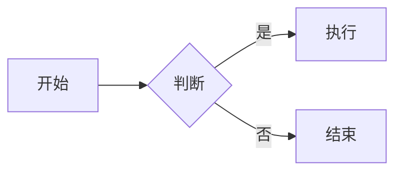

# CuteMarkEd 使用指南

本文档详细介绍 CuteMarkEd 的全部功能及使用方法。

---

## 目录

- [基本操作](#基本操作)
- [编辑功能](#编辑功能)
- [预览与视图](#预览与视图)
- [导出与打印](#导出与打印)
- [Markdown 扩展](#markdown-扩展)
- [查找与替换](#查找与替换)
- [拼写检查](#拼写检查)
- [表格与图片工具](#表格与图片工具)
- [模板系统](#模板系统)
- [多标签编辑](#多标签编辑)
- [文件浏览器](#文件浏览器)
- [代码片段补全](#代码片段补全)
- [专注模式](#专注模式)
- [写作辅助](#写作辅助)
- [学术引用管理](#学术引用管理)
- [翻译功能](#翻译功能)
- [语音输入](#语音输入)
- [AI 写作助手](#ai-写作助手)
- [数据可视化](#数据可视化)
- [文档加密](#文档加密)
- [版本控制（Git）](#版本控制git)
- [云同步](#云同步)
- [发布与分享](#发布与分享)
- [实时协作](#实时协作)
- [搜索功能](#搜索功能)
- [插件与脚本](#插件与脚本)
- [快捷键一览](#快捷键一览)

---

## 基本操作

### 新建文件

- 菜单：**文件** → **新建** (`Ctrl+N`)
- 创建一个空白的 Markdown 文档。

### 打开文件

- 菜单：**文件** → **打开** (`Ctrl+O`)
- 支持 `.md`、`.markdown`、`.mdown`、`.txt` 等格式。
- 最近打开的文件可在 **文件** → **最近文件** 中快速访问。

### 保存文件

- **保存**：`Ctrl+S` — 保存当前文件。
- **另存为**：`Ctrl+Shift+S` — 将文件保存到新位置。

---

## 编辑功能

### 基本编辑

| 操作 | 快捷键 |
|------|--------|
| 撤销 | `Ctrl+Z` |
| 重做 | `Ctrl+Y` |
| 剪切 | `Ctrl+X` |
| 复制 | `Ctrl+C` |
| 粘贴 | `Ctrl+V` |
| 复制 HTML 到剪贴板 | 菜单操作 |

### Markdown 格式化

| 操作 | 快捷键 |
|------|--------|
| **加粗** | `Ctrl+B` |
| *斜体* | `Ctrl+I` |
| ~~删除线~~ | 菜单操作 |
| `行内代码` | 菜单操作 |
| 居中段落 | 菜单操作 |
| 硬换行 | 菜单操作 |
| 引用块 | `Ctrl+>` |
| 增加标题级别 | `Ctrl+]` |
| 减少标题级别 | `Ctrl+[` |

**使用方法：** 选中文本后按快捷键，或通过 **编辑** → **格式** 子菜单选择格式。

### 跳转到行

- `Ctrl+G`：输入行号快速跳转。

---

## 预览与视图

### 实时预览

编辑器默认分为左右两栏：左侧为 Markdown 编辑区，右侧为实时 HTML 预览。编辑时预览会自动同步更新。

### 调整分栏比例

| 比例 | 快捷键 |
|------|--------|
| 1:1（等分） | `Ctrl+1` |
| 2:1（编辑区更大） | `Ctrl+2` |
| 1:2（预览区更大） | `Ctrl+3` |
| 3:1 | `Ctrl+4` |
| 1:3 | `Ctrl+5` |

### 查看 HTML 源码

- `F5`：在预览区域切换"渲染预览"和"HTML 源码"视图。

### 水平布局

- `Ctrl+Shift+L`：切换编辑器和预览的排列方向（水平/垂直）。

### 全屏模式

- `F11`：进入/退出全屏模式。

### 预览主题

- 菜单：**预览** → **预览主题**
- 可选择多种内置主题，也支持编辑、导入、导出自定义主题。

### 目录面板

- 菜单：**视图** → **目录** — 在侧栏显示文档的标题结构。
- 菜单：**预览** → **浮动目录** (`Ctrl+Shift+T`) — 在预览区显示浮动目录。

---

## 导出与打印

### 导出为 HTML

- 菜单：**文件** → **导出为 HTML** (`Ctrl+E`)
- 在导出对话框中可选择是否内嵌 CSS 样式。

### 导出为 PDF

- 菜单：**文件** → **导出为 PDF** (`Ctrl+Shift+E`)
- 可设置页面大小、边距等选项。

### 导出为 EPUB

- 菜单：**发布** → **导出为 EPUB** (`Ctrl+Shift+B`)

### 导出为图片

- 菜单：**分享** → **导出为 PNG**
- 菜单：**分享** → **导出为 SVG**

### 打印

- `Ctrl+P`：打印当前文档。
- 菜单：**预览** → **打印预览** (`Ctrl+Shift+P`) — 打印前预览效果。

---

## Markdown 扩展

菜单：**扩展**，可启用/禁用以下 Markdown 扩展功能：

| 扩展 | 说明 |
|------|------|
| 数学公式支持 | 使用 `$...$` 行内公式和 `$$...$$` 块公式 |
| 图表支持 | 使用 Mermaid 语法创建流程图、时序图等 |
| YAML 头信息 | 识别文档顶部的 YAML Front Matter |
| 代码高亮 | 对代码块进行语法高亮 |
| 显示特殊字符 | 显示空格、制表符等不可见字符 |
| 自动换行 | 编辑器中长行自动折行 |

### Markdown 语法扩展

在 **扩展** → **Markdown 扩展** 子菜单中，可单独启用：

- **自动链接** — URL 自动转为可点击链接
- **删除线** — `~~文本~~` 语法
- **字母列表** — 支持 a. b. c. 有序列表
- **定义列表** — 使用 `: 定义` 语法
- **SmartyPants** — 自动将引号转为印刷体引号
- **脚注** — `[^1]` 脚注语法
- **上标** — `^上标^` 语法

### Mermaid 图表示例

在代码块中使用 `mermaid` 语言标识：

````markdown

````

支持的图表类型：流程图、时序图、甘特图、类图等。

---

## 查找与替换

- **查找与替换**：`Ctrl+H` — 打开查找替换栏。
- **查找下一个**：`F3`
- **查找上一个**：`Shift+F3`
- 按 `Esc` 关闭查找替换栏。

---

## 拼写检查

- 菜单：**扩展** → **拼写检查** — 开启后，拼写错误会用波浪线标记。
- 菜单：**写作** → **拼写检查** (`F7`) — 执行全文拼写检查。
- 菜单：**扩展** → **语言** — 选择拼写检查使用的语言。
- 菜单：**写作** → **添加到词典** — 将当前选中的词加入自定义词典。
- 菜单：**写作** → **管理词典** — 查看和编辑自定义词典。

---

## 表格与图片工具

### 插入表格

- `Ctrl+T`：打开表格工具对话框。
- 设置行数、列数和对齐方式。
- 点击确定后自动在光标位置插入 Markdown 表格。

### 插入图片

- `Ctrl+'`：打开图片工具对话框。
- 可输入图片 URL 或选择本地文件。
- 自动生成 `` 格式的 Markdown 图片语法。

---

## 模板系统

### 从模板新建

- 菜单：**模板** → **从模板新建** (`Ctrl+Shift+N`)
- 选择预设模板快速创建文档。

### 快速模板

- 菜单：**模板** → **快速模板** — 一键应用常用模板。

### 管理模板

- 菜单：**模板** → **管理模板**
- 添加、编辑、删除自定义模板。

---

## 多标签编辑

### 标签操作

| 操作 | 快捷键 |
|------|--------|
| 新建标签页 | `Ctrl+T` |
| 关闭当前标签 | `Ctrl+W` |
| 关闭所有标签 | 菜单操作 |
| 下一个标签 | `Ctrl+Tab` |
| 上一个标签 | `Ctrl+Shift+Tab` |
| 恢复已关闭标签 | `Ctrl+Shift+T` |
| 快速切换到第 N 个标签 | `Alt+1` 至 `Alt+9` |

---

## 文件浏览器

- 菜单：**视图** → **文件浏览器** — 在侧栏显示文件浏览器。
- 浏览当前目录下的文件，点击文件直接打开。

---

## 代码片段补全

编辑器内置代码片段自动补全功能：

- 输入常用 Markdown 语法的缩写，编辑器会弹出补全建议。
- 同时支持从当前文档中提取单词进行自动补全。
- 按 `Tab` 或 `Enter` 确认补全。

---

## 专注模式

菜单：**视图** → **专注模式** 子菜单

### 开启专注模式

- `Ctrl+Shift+F`：进入/退出专注模式。
- 专注模式下，编辑器会淡化当前焦点之外的内容，帮助集中注意力。

### 焦点范围

可选择不同的聚焦粒度：

- **当前行** — 仅高亮当前行（默认）
- **当前句子** — 高亮当前句子
- **当前段落** — 高亮当前段落
- **当前章节** — 高亮当前标题下的内容

### 滚动模式

- **普通模式** — 正常滚动
- **打字机模式** — 当前行始终保持在屏幕中央

### 专注模式主题

- 浅色主题
- 深色主题
- 复古主题（Sepia）

---

## 写作辅助

### 字数统计

- 菜单：**写作** → **字数统计面板** (`Ctrl+Shift+W`)
- 显示字数、字符数、段落数等统计信息。

### 文档大纲

- 菜单：**写作** → **文档大纲** (`Ctrl+Shift+O`)
- 以树形结构展示文档标题，点击可快速跳转。

### 书签

| 操作 | 快捷键 |
|------|--------|
| 添加书签 | `Ctrl+B` |
| 删除书签 | 菜单操作 |
| 下一个书签 | `F2` |
| 上一个书签 | `Shift+F2` |
| 书签列表 | 菜单操作 |

### 写作目标

- 菜单：**写作** → **设置每日目标** — 设定每天要写的字数目标。
- 菜单：**写作** → **设置本次目标** — 设定本次编辑的字数目标。
- 菜单：**写作** → **写作统计** — 查看历史写作数据。

---

## 学术引用管理

### 打开引用管理器

- 菜单：**工具** → **引用管理器** (`Ctrl+Shift+C`)

### 管理引用库

1. 创建或加载 `.bib` 文件（BibTeX 格式）。
2. 添加、编辑、删除引用条目。
3. 首次打开时会自动加载 15 条示例条目。

### 支持的引用类型

期刊文章、书籍、会议论文、硕士论文、博士论文、技术报告、在线资源、专利等。

### 插入引用

- 菜单：**工具** → **插入引用** (`Ctrl+Alt+C`)
- 在文档中插入 `[@引用键]` 格式的引用标记。
- 多条引用：`[@key1; @key2; @key3]`

### 生成参考文献

- 菜单：**工具** → **生成参考文献**
- 自动在文档末尾生成参考文献列表。

### 引用样式

支持以下引用格式，在引用管理器中切换：

| 样式 | 说明 |
|------|------|
| APA | 美国心理学会格式（第 7 版） |
| MLA | 现代语言学会格式（第 9 版） |
| Chicago | 芝加哥格式（第 17 版） |
| IEEE | 电气电子工程师学会格式 |
| Harvard | 哈佛格式 |
| Vancouver | 温哥华格式（医学领域） |
| GB/T 7714 | 中国国标格式 |

### 导入引用

支持通过以下方式导入：
- DOI 号
- ISBN 号
- arXiv ID
- PubMed ID

### 导出引用

支持导出为 RIS、EndNote、CSV 格式。

---

## 翻译功能

### 翻译选中文本

- 菜单：**工具** → **翻译选中文本** (`Ctrl+Shift+T`)
- 在弹出对话框中选择源语言和目标语言，点击翻译。

### 翻译整篇文档

- 菜单：**工具** → **翻译文档**

### 翻译设置

- 菜单：**工具** → **翻译设置**

#### 支持的翻译引擎

| 引擎 | 需要的凭证 |
|------|-----------|
| 百度翻译 | AppID + 密钥 |
| 有道翻译 | 应用 ID + API Key + 应用秘钥 |
| DeepL | API Key |
| Google 翻译 | API Key |
| 腾讯翻译 | AppID + 密钥 |
| 离线翻译 | 无需凭证 |

#### 配置步骤

1. 打开翻译设置。
2. 选择翻译引擎。
3. 填入对应的 API 凭证（不同引擎所需字段不同，界面会动态提示）。
4. 点击保存。

---

## 语音输入

### 开始语音输入

- 菜单：**工具** → **开始语音输入** (`Ctrl+Shift+V`)
- 再次点击停止语音输入。

### 语音设置

- 菜单：**工具** → **语音输入设置**
- 配置语音识别引擎和语言。

---

## AI 写作助手

### AI 功能

| 功能 | 快捷键/操作 |
|------|------------|
| AI 自动补全 | `Ctrl+J` |
| 语法检查 | `Ctrl+Shift+G` |
| 生成摘要 | 菜单操作 |
| 生成标题建议 | 菜单操作 |

### AI 助手面板

- 菜单：**AI** → **显示 AI 助手面板** — 在侧栏显示 AI 对话面板。
- 菜单：**AI** → **分离为浮动窗口** — 将面板独立为悬浮窗口。

### AI 设置

- 菜单：**AI** → **AI 设置**
- 配置 AI 模型、API 密钥等参数。

---

## 数据可视化

- 菜单：**视图** → **数据可视化面板**
- 可将代码块中的数据渲染为可视化图表。

---

## 文档加密

### 加密文件

- 菜单：**安全** → **加密文件** (`Ctrl+Shift+E`)
- 设置密码后对当前文档进行加密保存。

### 解密文件

- 菜单：**安全** → **解密文件** (`Ctrl+Shift+D`)
- 输入密码解密已加密的文档。

### 打开加密文件

- 菜单：**安全** → **打开加密文件**
- 选择加密文件并输入密码打开。

### 生物认证

- 在支持的设备上（如带 Touch ID 的 Mac），可使用生物识别替代密码。

### 安全设置

- 菜单：**安全** → **安全设置**
- 配置加密算法、密钥派生参数等。

---

## 版本控制（Git）

### 版本历史

- 菜单：**版本控制** → **版本历史** (`Ctrl+Shift+H`)
- 查看文件的历次提交记录。

### 查看修改

- 菜单：**版本控制** → **查看修改** (`Ctrl+Shift+D`)
- 查看当前文件相对于上次提交的改动。

### 提交修改

- 菜单：**版本控制** → **提交修改** (`Ctrl+Shift+C`)
- 输入提交信息并提交。

### 远程操作

- **推送到远程**：将本地提交推送到远程仓库。
- **拉取更新**：从远程仓库拉取最新代码。

### Git LFS

- 菜单：**版本控制** → **启用 Git LFS** — 对当前仓库启用大文件存储。
- 菜单：**版本控制** → **管理 LFS 跟踪规则**
- 菜单：**版本控制** → **跟踪常见大文件类型** — 一键配置常见大文件的 LFS 规则。

### 时间线

- 菜单：**时间线** → **显示时间线面板** (`Ctrl+Shift+T`)
- 以可视化方式展示文档的修改历史。
- 菜单：**时间线** → **版本对比模式** — 对比不同版本之间的差异。

---

## 云同步

### 立即同步

- 菜单：**同步** → **立即同步** (`Ctrl+Shift+S`)
- 手动触发云同步，同步完成后会弹出结果提示。

### 同步设置

- 菜单：**同步** → **同步设置**
- 配置云服务提供商、同步间隔、自动同步等选项。
- 默认开启自动同步（每 5 分钟），自动同步完成后仅在状态栏提示，不弹窗。

---

## 发布与分享

### 演示文稿模式

- 菜单：**预览** → **开始演示** (`F5`)
- 菜单：**发布** → **开始幻灯片** (`Shift+F5`)
- 将 Markdown 文档以 Reveal.js 幻灯片形式展示。
- 使用 `---` 分隔幻灯片页面。

### 博客发布

- 菜单：**发布** → **发布到博客** (`Ctrl+Shift+P`)
- 菜单：**发布** → **博客设置** — 配置博客平台账号。

### 静态站点

- 菜单：**发布** → **发布到静态站点**
- 菜单：**发布** → **静态站点管理器**

### 分享链接

- 菜单：**分享** → **生成分享链接** (`Ctrl+Shift+S`)
- 菜单：**分享** → **分享管理器** — 管理已生成的分享链接。

### 评论系统

- 菜单：**分享** → **评论** → **添加评论** (`Ctrl+Shift+M`)
- 菜单：**分享** → **评论** → **显示评论面板**
- 菜单：**分享** → **评论** → **导出评论**

### 修订历史

- 菜单：**分享** → **修订历史** → **查看修订历史** (`Ctrl+Alt+H`)
- 菜单：**分享** → **修订历史** → **创建修订点** — 手动创建一个保存点。
- 菜单：**分享** → **修订历史** → **对比修订** — 对比两个修订版本的差异。
- 菜单：**分享** → **修订历史** → **恢复修订** — 将文档恢复到指定版本。

---

## 实时协作

### 发起协作

- 菜单：**分享** → **实时协作** → **开始托管** (`Ctrl+Shift+H`)
- 启动协作服务器，生成加入链接。

### 加入协作

- 菜单：**分享** → **实时协作** → **加入会话** (`Ctrl+Shift+J`)
- 输入协作链接加入他人的编辑会话。

### 协作面板

- 菜单：**分享** → **实时协作** → **显示协作面板**
- 查看当前连接的协作者及其光标位置。

### 断开连接

- 菜单：**分享** → **实时协作** → **断开连接**

---

## 搜索功能

### 全文搜索

- 菜单：**搜索** → **搜索** (`Ctrl+Shift+F`)
- 基于索引的全文搜索，速度快。

### 索引管理

- 菜单：**搜索** → **重建搜索索引** — 手动重建索引。
- 菜单：**搜索** → **搜索历史** — 查看历史搜索记录。
- 菜单：**搜索** → **清除搜索历史**

---

## 笔记库

### 笔记库管理

- 菜单：**笔记库** → **笔记库管理器** (`Ctrl+Shift+L`)
- 管理文档集合，支持文件夹和标签分类。

### 快速搜索

- 菜单：**笔记库** → **快速搜索** (`Ctrl+Shift+F`)
- 在笔记库中快速查找文档。

### 标签管理

- 菜单：**笔记库** → **标签管理器** — 创建、编辑、删除标签。

---

## 插件与脚本

### 插件管理

- 菜单：**扩展** → **插件** → **插件管理器**
- 安装、启用、禁用插件。

### 内置脚本

菜单：**扩展** → **脚本**

| 脚本 | 快捷键 | 说明 |
|------|--------|------|
| 转为大写 | `Ctrl+Shift+U` | 将选中文本转为大写 |
| 转为小写 | `Ctrl+Shift+L` | 将选中文本转为小写 |
| 排序行 | — | 按字母顺序排列选中行 |
| 删除重复行 | — | 移除选中内容中的重复行 |
| 插入日期时间 | `Ctrl+Shift+D` | 在光标处插入当前日期和时间 |
| 字数统计 | — | 统计选中文本的字数 |

### 编辑器主题

- 菜单：**扩展** → **编辑器主题** — 选择编辑器配色方案。
- 菜单：**扩展** → **编辑器主题** → **主题编辑器** — 自定义编辑器主题。

### 快捷键设置

- 菜单：**扩展** → **快捷键设置** — 自定义所有快捷键。

---

## 快捷键一览

### 文件操作

| 快捷键 | 功能 |
|--------|------|
| `Ctrl+N` | 新建文件 |
| `Ctrl+O` | 打开文件 |
| `Ctrl+S` | 保存 |
| `Ctrl+Shift+S` | 另存为 |
| `Ctrl+E` | 导出 HTML |
| `Ctrl+Shift+E` | 导出 PDF |
| `Ctrl+P` | 打印 |

### 编辑操作

| 快捷键 | 功能 |
|--------|------|
| `Ctrl+Z` | 撤销 |
| `Ctrl+Y` | 重做 |
| `Ctrl+B` | 加粗 |
| `Ctrl+I` | 斜体 |
| `Ctrl+>` | 引用块 |
| `Ctrl+]` | 增加标题级别 |
| `Ctrl+[` | 减少标题级别 |
| `Ctrl+T` | 插入表格 |
| `Ctrl+'` | 插入图片 |
| `Ctrl+G` | 跳转到行 |

### 查找

| 快捷键 | 功能 |
|--------|------|
| `Ctrl+H` | 查找与替换 |
| `F3` | 查找下一个 |
| `Shift+F3` | 查找上一个 |
| `Ctrl+Shift+F` | 全文搜索 |

### 视图

| 快捷键 | 功能 |
|--------|------|
| `Ctrl+1` ~ `Ctrl+5` | 调整分栏比例 |
| `Ctrl+Shift+L` | 水平/垂直布局切换 |
| `F5` | HTML 源码 / 预览切换 |
| `F11` | 全屏模式 |
| `Ctrl+Shift+F` | 专注模式 |

### 标签页

| 快捷键 | 功能 |
|--------|------|
| `Ctrl+T` | 新建标签 |
| `Ctrl+W` | 关闭标签 |
| `Ctrl+Tab` | 下一个标签 |
| `Ctrl+Shift+Tab` | 上一个标签 |
| `Ctrl+Shift+T` | 恢复已关闭标签 |
| `Alt+1` ~ `Alt+9` | 切换到对应标签 |

### 工具

| 快捷键 | 功能 |
|--------|------|
| `Ctrl+Shift+C` | 引用管理器 |
| `Ctrl+Alt+C` | 插入引用 |
| `Ctrl+Shift+T` | 翻译选中文本 |
| `Ctrl+Shift+V` | 语音输入 |
| `Ctrl+J` | AI 自动补全 |
| `Ctrl+Shift+G` | AI 语法检查 |

### 写作

| 快捷键 | 功能 |
|--------|------|
| `Ctrl+Shift+W` | 字数统计面板 |
| `Ctrl+Shift+O` | 文档大纲 |
| `F2` | 下一个书签 |
| `Shift+F2` | 上一个书签 |
| `F7` | 拼写检查 |

### 版本控制

| 快捷键 | 功能 |
|--------|------|
| `Ctrl+Shift+H` | 版本历史 |
| `Ctrl+Shift+D` | 查看修改 |
| `Ctrl+Shift+C` | 提交修改 |

> **提示：** 所有快捷键均可在 **扩展** → **快捷键设置** 中自定义修改。macOS 上 `Ctrl` 对应 `Cmd` 键。

---

## 选项设置

- 菜单：**扩展** → **选项**
- 在选项对话框中可配置：
  - 编辑器字体和字号
  - 制表符宽度
  - 预览默认字体和字号
  - 默认 Markdown 转换器
  - 自动保存间隔
  - 界面语言
  - 编辑器样式
  - 以及其他个性化设置
